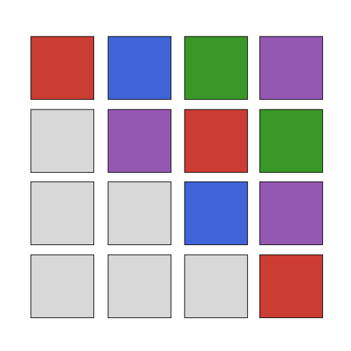

# NNop.jl



[buildkite-img]: https://badge.buildkite.com/b30cae2b9773cfd3464e6dad35de6a4a7151a6cb161da14c33.svg?branch=master
[buildkite-img-amdgpu]: https://badge.buildkite.com/b30cae2b9773cfd3464e6dad35de6a4a7151a6cb161da14c33.svg?branch=master&step=AMDGPU%20-%20Julia%201.12
[buildkite-img-cuda]: https://badge.buildkite.com/b30cae2b9773cfd3464e6dad35de6a4a7151a6cb161da14c33.svg?branch=master&step=CUDA%20-%20Julia%201.12
[buildkite-url]: https://buildkite.com/julialang/nnop-dot-jl

Fused kernels (with [ChainRules.jl](https://github.com/JuliaDiff/ChainRules.jl) integration):

- [Flash Attention](#flash-attention)
- [Softmax](#softmax)
- [RMS Norm](#rms-norm)
- [Layer Norm](#layer-norm)
- [Llama RoPE](#llama-rope)

|GPU Backend|CI Status|
|-|-|
|[AMDGPU](https://github.com/JuliaGPU/AMDGPU.jl)|[![][buildkite-img-amdgpu]][buildkite-url]|
|[CUDA](https://github.com/JuliaGPU/CUDA.jl)|[![][buildkite-img-cuda]][buildkite-url]|

## Benchmarking

See `benchmarks/main.jl` for comparison scripts between naїve & fused versions.

## Flash Attention

Implementation of [FlashAttention: Fast and Memory-Efficient Exact Attention with IO-Awareness](https://arxiv.org/abs/2205.14135).

```julia
E, L, H, B = 64, 4096, 4, 4
causal = false

q = ROCArray(rand(Float32, E, L, H, B))
k = ROCArray(rand(Float32, E, L, H, B))
v = ROCArray(rand(Float32, E, L, H, B))

o = NNop.flash_attention(q, k, v; causal)
∇ = Zygote.gradient(q, k, v) do q, k, v
    sum(NNop.flash_attention(q, k, v; causal))
end
```

### Features:

- Forward & backward passes.
- Arbitrary sequence length.
- FP32, FP16, BFP16 support.
- Variable sequence length.
- Causal masking.

## Softmax

Implementation of [Online normalizer calculation for softmax](https://arxiv.org/abs/1805.02867).

```julia
x = ROCArray(rand(Float32, 8192, 1024))
y = NNop.online_softmax(x)
```

## RMS Norm

```julia
x = ROCArray(rand(Float32, 1024, 1024))
w = ROCArray(rand(Float32, 1024))
y = NNop.rms_norm(x, w)
∇ = Zygote.gradient(x, w) do x, w
    sum(NNop.rms_norm(x, w))
end
```

## Layer Norm

```julia
x = ROCArray(rand(Float32, 1024, 1024))
w = ROCArray(rand(Float32, 1024))
w = ROCArray(rand(Float32, 1024))
y = NNop.layer_norm(x, w)
∇ = Zygote.gradient(x, w, b) do x, w, b
    sum(NNop.layer_norm(x, w, b))
end
```

## Llama RoPE

```julia
E, L, B = 16, 1024, 1
QH, KH = 16, 16

emb = NNop.LlamaRotaryEmbedding(E)
position_ids = reshape(collect(0f0:Float32(L) - 1f0), :, 1)
position_ids = repeat(position_ids; inner=(1, B))

cos, sin = emb(position_ids)
cos = Adapt.adapt(kab, cos)
sin = Adapt.adapt(kab, sin)

q = Adapt.adapt(kab, ones(Float32, (E, L, QH, B)))
k = Adapt.adapt(kab, ones(Float32, (E, L, KH, B)))
q, k = NNop.llama_rope(q, k; cos, sin)
```
